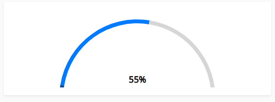

# Progress Kit

A React progress bar components kit. Includes provider for automatic page transitions and manual progress components.

## Installation

```bash
npm install mt-progress-kit
```

## Usage

### Progress Provider (Automatic Page Transitions)


```jsx
'use client';

import { ProgressProvider } from 'mt-progress-kit';

function App() {
  return (
    <div>
      <ProgressProvider 
        type="line" 
        height="4px" 
        bgColor="#007bff"
      />
      {/*content */}
    </div>
  );
}


```


### Layout Example

```jsx
'use client';

import { ProgressProvider } from 'mt-progress-kit';

function Layout({ children }) {
  return (
     <html lang="en">
      <body>
      <ProgressProvider 
        type="line" 
        height="3px" 
        bgColor="#007bff"
      />
      {children}
    </body>
    </html>
  );
}
```

### Circular Progress (Manual)

```jsx
import { CircularProgress } from 'mt-progress-kit';

function App() {
  return (
    <CircularProgress 
      value={75} 
      size="medium"
      variant="primary"
    />
  );
}
```

### Line Progress (Manual)

```jsx
import { LineProgress } from 'mt-progress-kit';

function App() {
  return (
    <LineProgress 
      value={60} 
      size="medium"
      variant="success"
    />
  );
}
```

### Half Circular Progress

```jsx
import { HalfProgress } from 'mt-progress-kit';

function App() {
  return (
    <HalfProgress 
      value={50} 
      size="medium"
      variant="warning"
    />
  );
}
```



## License

MIT 